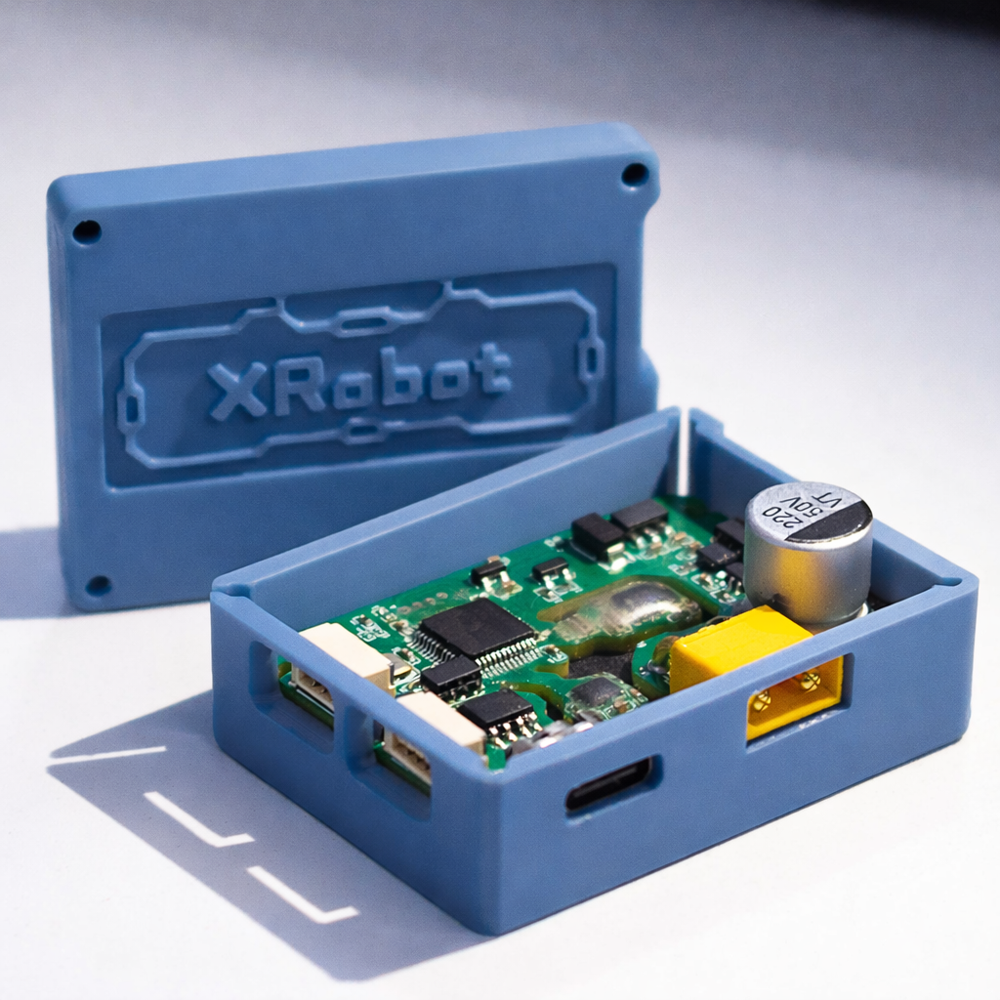
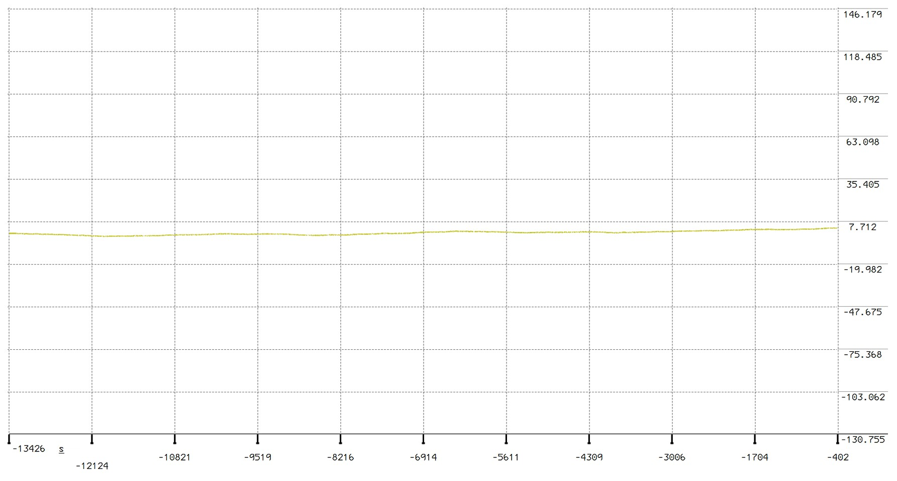
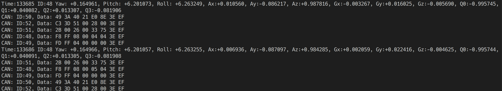
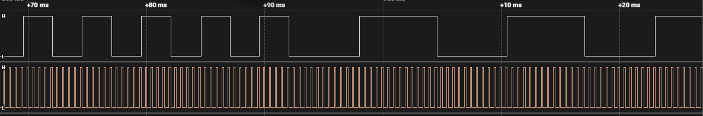
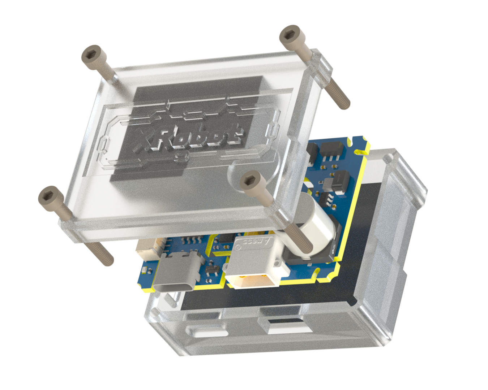

# ATOM-IMU 模块 V5.3



## **参数**

- **输出频率**：2-2000Hz
- **支持电压**：5V/24V
- **接口**：USB / UART / CAN
- **支持数据类型**：加速度计 (ACC) / 陀螺仪 (GYRO) / 欧拉角 (EULR) / 四元数 (QUAT)
- **UART 波特率**：2M (数据)
- **CAN 波特率**：1M
- **陀螺仪**：最大量程 ±2000DPS
- **加速度计**：最大量程 ±24G

usb接口会在电脑上枚举出两个CDC虚拟串口，分别为命令行与数据输出。虚拟串口输出的IMU数据与硬件串口格式相同。

不建议使用USB转TTL连接硬件串口。硬件串口波特率较高，需要选择支持此波特率（2M）的USB转TTL模块。模块自带的USB接口延迟更低，速度更快。

## **Yaw轴零漂测试**

零偏通常在10°/h以下，校准环境较好时可达3°/h以下。



## **连接方式**

- **USB**：`UART1(数据输出) UART2(命令行)`
- **UART GH1.25 4P**：
  - `1: SYNC / FSYNC`（可配置为输入或输出）
  - `2: TX`
  - `3: GND`
  - `4: +5V_IN`
- **CAN GH1.25 4P**：
  - `1: CANL`
  - `2: CANH`
  - `3: GND`
  - `4: +5V_IN`
- **XT30 供电**：`24V_IN`

## **示例代码**

```shell
├── linux_uart_example      `Linux UART 解析示例`
├── ros_imu_publisher       `ROS IMU 发布节点`
├── ros_imu_subscriber      `ROS IMU 订阅节点`
├── ros_rviz_example.rviz   `ROS RViz 可视化`
└── stm32_can_example       `STM32 CAN 解析示例（5.3不支持CANFD）`
```

### **Linux UART 示例**



编译并运行示例：

```shell
gcc main.c -o main
./main
```

### **ROS 示例**

VERSION=`rolling`

#### 发布

```shell
colcon build
source install/setup.zsh
ros2 run imu_publisher node_imu
```

#### 订阅

```shell
colcon build
source install/setup.zsh
ros2 run imu_subscriber node_imu
```

### **RViz 可视化**

使用 `ros_rviz_example.rviz` 在 RViz2 中打开。

### **STM32 CAN 示例**

```shell
make
```

## **终端交互**

使用 `picocom`、`putty`、`MobaXTerm` 等工具进行交互，连接USB枚举出的第二个串口设备即可。
示例操作：

```shell
linux@XRobot:~$ ls /dev/ttyACM*
/dev/ttyACM0  /dev/ttyACM1

linux@XRobot:~$ picocom /dev/ttyACM1
```

回车后示例输出：

```shell
XRobot:/$
```

## **IMU 设置**

```shell
# 输入set_imu命令并回车
XRobot:/$ set_imu
# 这一行显示IMU CAN输出的状态，CAN/UART输出同时只能有一个开启
can output disabled.
# 这一行显示IMU 串口输出的状态
uart output enabled.
# 这一行表示帧同步信号FSYNC的模式：
#   0=不启用
#   1=检测上升沿
#   2=检测下降沿
#   3=同时检测上升沿/下降沿
#   4=输出FSYNC时钟（UART口 SYNC/FSYNC 引脚输出）
# 第二个数字代表最近一次FSYNC事件的时间（微秒）
# 第三个数字代表最近一次IMU数据时间戳（微秒）
FSYNC:4 6685000 6690413
# 当 fsync=4（输出）时，会额外显示输出分频参数（Div）
Div:10
# 这一行显示两次反馈数据的时间间隔，单位500us
feedback delay:1
# 这一行显示IMU数据帧的ID
id:48

Usage:
        set_delay  [time]  设置发送延时 1=500us
        set_div    [div]   设置clk_out(FSYNC)分频
        set_can_id [id]    设置can id
        just_float         设置vofa+ just_float输出
        # accl/gyro/quat/eulr只对can模式发送有效
        enable/disable     [accl/gyro/quat/eulr/can/uart]
        fsync              [0: disable 1: rise 2: fall 3: both 4: output]           设置fsync模式
```

## **校准（Calibration）**

完整校准过程约需 **20 分钟**，过程中需要保证 IMU 稳定，每次更改IMU方向后需要等待1分钟以上来使角度稳定。校准的每一步都无顺序要求，可以多次尝试。

```shell
# 上电后等待十分钟，IMU预热
XRobot:/$ imu1 show 600000 1000
# IMU平放，LOGO面朝上
XRobot:/$ imu1 cali
...
# 校准误差绝对值在0.00003以下视为校准成功，理想情况下应当小于0.000015
Calibration error -0.000013
Calibration data saved.
# 更改方向，USB接口面朝下
XRobot:/$ imu1 cali
...
# 侧放IMU，使GH1.25接口朝上
XRobot:/$ imu1 cali
...
# 再次将IMU平放，LOGO面朝上
XRobot:/$ imu2 cali
...
# 搜索得到当地的经纬度，可在谷歌地图中直接右键复制。例如格拉斯哥的经纬度为：55.87241068336635 -4.290120205979219
XRobot:/$ ahrs set_location 55.87 -4.29
Done.
# 校准完成
```

## **测量零漂**

仅作参考，以实际情况为准

```shell
XRobot:/$ ahrs test
Please keep the device steady, start measurement
Please wait
Zero offset:-0.035189°/min
```

## **VOFA+ 可视化数据**

请添加以下自定义命令，使用VOFA+可视化数据。
数据分别为：`w x y z pitch roll yaw`

```shell
ahrs print_quat 1000000 10\r\n
```

## **调整恒温温度**

```shell
# 设置恒温温度  
# 两个IMU温度同步，修改一个即可
XRobot:/$ imu1 set_temp 45

# 重新上电并校准
```

## **FSYNC 输入模式（fsync=1/2/3）**

根据触发模式的不同，`Data.sync`会记录输入信号的边沿触发时间。

## **FSYNC 输出模式（fsync=4）**

当 `fsync` 设置为 `4` 时，模块会在 **UART GH1.25 的 1 号脚（SYNC/FSYNC）** 输出方波时钟，用于外部同步。

- `Data.sync` 字段记录**最近一次 FSYNC 输出上升沿所对应的 IMU 采样结束/数据就绪时间戳**（微秒）
- `Data.sync` 仅在 FSYNC 上升沿发生时更新，其余数据帧会保持为“最近一次上升沿对应的 `sync` 值”
- FSYNC 输出上升沿相对 `Data.sync` 的延迟约为 **8.5µs**（典型值）
- 输出分频由 `set_div [div]` 控制（仅 `fsync=4` 时生效）
- `set_delay [delay]` 为发送/反馈节拍，单位 500µs（`delay=1` 即 500µs）
- 在当前固件中，内部数字滤波带来的群延迟典型值约为 **1.5ms**

输出周期计算：
- **翻转间隔**：`500µs × delay × div`
- **方波周期**：`500µs × delay × div × 2`

示例：`delay=2`（1ms），`div=5`  
方波周期 = `500µs × 2 × 5 × 2 = 10ms`，即 **100Hz**。

---

## **路径延迟**

在当前配置下，IMU 采样周期约为 **500µs**。  
IMU 采样结束到 FSYNC 输出**上升沿**需要约 **8.5µs**。

例如使用 FSYNC 触发相机采集时：

- IMU 采样时间中点约为：`Data.sync - 250µs`
- 相机采集时间中点约为：`Data.sync + 8.5µs + 相机触发上升沿延迟 + 曝光时间/2`

因此可结合 `Data.sync` 与 `Data.time`，在 IMU 数据流中选择**距离相机采集时间中点最近**的 IMU 数据帧。

此外，更改 `set_delay [delay]` 或 `set_div [div]` 均会在**当前周期结束后**生效，运行时更改不会导致相位偏移。  
因此可通过调整 `div`，并同时监控**相机帧时间差**与**IMU 数据时间差**（相对上一帧的 Δt）来对齐相机与 IMU 数据。




## 3D 模型

[Top Model](./3D/Top.step)

[Bottom Model](./3D/Bottom.step)



## **传输协议**

### **UART 协议**

- 数据帧包括：前缀，微秒时间戳（time），同步时间戳（sync），四元数，角速度，加速度，欧拉角，CRC8 校验。

```c++
typedef struct __attribute__((packed)) {
  float x;
  float y;
  float z;
} Vector3;

typedef struct __attribute__((packed)) {
  float q0;
  float q1;
  float q2;
  float q3;
} Quaternion;

typedef struct __attribute__((packed)) {
  float yaw;
  float pit;
  float rol;
} EulerAngles;

typedef struct __attribute__((packed))
{
  uint8_t prefix;
  uint64_t time : 40;
  uint64_t sync : 40;
  Quaternion quat_;
  Vector3 gyro_;
  Vector3 accl_;
  EulerAngles eulr_;
  uint8_t crc8;
} Data;
```

### **CAN 协议**

```c++
#define ENCODER_21_MAX_INT ((1u << 21) - 1)
#define CAN_PACK_ID_ACCL 0
#define CAN_PACK_ID_GYRO 1
#define CAN_PACK_ID_EULR 3
#define CAN_PACK_ID_QUAT 4

typedef union {
  struct __attribute__((packed)) {
    int32_t data1 : 21;
    int32_t data2 : 21;
    int32_t data3 : 21;
    int32_t res : 1;
  };
  struct __attribute__((packed)) {
    uint32_t data1_unsigned : 21;
    uint32_t data2_unsigned : 21;
    uint32_t data3_unsigned : 21;
    uint32_t res_unsigned : 1;
  };
  uint8_t raw[8];
} CanData3;

typedef struct __attribute__((packed)) {
  union {
    int16_t data[4];
    uint16_t data_unsigned[4];
  };
} CanData4;

typedef struct {
  struct {
    float x, y, z;
  } accl;
  struct {
    float x, y, z;
  } gyro;
  struct {
    float pitch, roll, yaw;
  } eulr;
  struct {
    float w, x, y, z;
  } quat;
  uint64_t timestamp;
  uint64_t sync_time;
} ImuData;

ImuData imu_data;

static float DecodeFloat21(uint32_t encoded, float min, float max) {
  float norm =
      (float)(encoded & ENCODER_21_MAX_INT) / (float)ENCODER_21_MAX_INT;
  return min + norm * (max - min);
}

static float DecodeInt16Normalized(int16_t value) {
  return (float)value / (float)INT16_MAX;
}

static void ProcessClassicCanPacket(uint32_t id, uint8_t *data) {
  uint32_t packet_type = id - IMU_DEVICE_ID;

  switch (packet_type) {
  case CAN_PACK_ID_ACCL: {
    /* Accelerometer data: ±24g range */
    CanData3 *can_data = (CanData3 *)data;
    imu_data.accl.x = DecodeFloat21(can_data->data1_unsigned, -24.0f, 24.0f);
    imu_data.accl.y = DecodeFloat21(can_data->data2_unsigned, -24.0f, 24.0f);
    imu_data.accl.z = DecodeFloat21(can_data->data3_unsigned, -24.0f, 24.0f);
    break;
  }

  case CAN_PACK_ID_GYRO: {
    /* Gyroscope data: ±2000 deg/s converted to rad/s */
    CanData3 *can_data = (CanData3 *)data;
    float min_gyro = -2000.0f * M_PI / 180.0f;
    float max_gyro = 2000.0f * M_PI / 180.0f;
    imu_data.gyro.x =
        DecodeFloat21(can_data->data1_unsigned, min_gyro, max_gyro);
    imu_data.gyro.y =
        DecodeFloat21(can_data->data2_unsigned, min_gyro, max_gyro);
    imu_data.gyro.z =
        DecodeFloat21(can_data->data3_unsigned, min_gyro, max_gyro);
    break;
  }

  case CAN_PACK_ID_EULR: {
    /* Euler angles: ±π rad */
    CanData3 *can_data = (CanData3 *)data;
    imu_data.eulr.pitch = DecodeFloat21(can_data->data1_unsigned, -M_PI, M_PI);
    imu_data.eulr.roll = DecodeFloat21(can_data->data2_unsigned, -M_PI, M_PI);
    imu_data.eulr.yaw = DecodeFloat21(can_data->data3_unsigned, -M_PI, M_PI);
    break;
  }

  case CAN_PACK_ID_QUAT: {
    /* Quaternion data: normalized int16 */
    CanData4 *can_data = (CanData4 *)data;
    imu_data.quat.w = DecodeInt16Normalized(can_data->data[0]);
    imu_data.quat.x = DecodeInt16Normalized(can_data->data[1]);
    imu_data.quat.y = DecodeInt16Normalized(can_data->data[2]);
    imu_data.quat.z = DecodeInt16Normalized(can_data->data[3]);
    break;
  }

  default:
    /* Unknown packet type */
    break;
  }
}
```

## 烧录bootloader

通过短接boot（R66）进入DFU下载模式，或者使用1.25 4P探针连接SWD接口，烧录bootloader。烧录完成重启即可进入固件更新流程。

bootloader固件：[bootloader.bin](./firmware/bootloader.bin)

## **固件更新**

1. 获取最新固件：参考 `firmware` 目录。
2. 进入 Bootloader 模式：

   ```sh
   power bl
   ```

如从未烧录app固件，重启将会自动进入bootloader。

3. 重新插拔USB接口
4. 进入此网站：[ATOM-IMU 固件更新](https://jiu-xiao.github.io/webdfu/dfu-util/)，根据提示操作
5. 重新插拔USB接口

## **相关资源**

- [Bilibili 视频演示](https://www.bilibili.com/video/BV1iespeLE5S/?share_source=copy_web)


